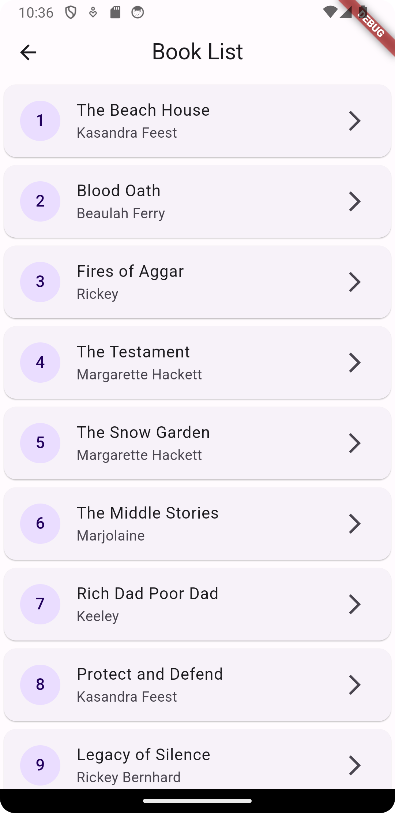

# etiya

etiya_flutter_assignment

## Book App
This app is a book app. You can view and list books. 

## Server information
Server is a grpc server. The server automatically starts when the app is run. Inner server port is 50051.

## Proto Generation
To generate the proto files, you need to run the following command in the terminal. 
```protoc --dart_out=grpc:lib/src/generated -Iprotos protos/book.proto```

## Using Packages
There are two packages used in this project.
- book_card
- book_detail

## Screenshots

